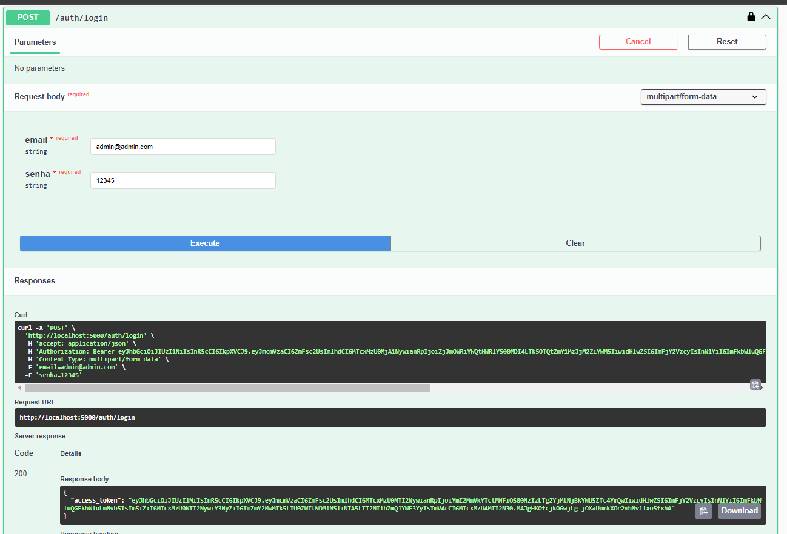

# BOP Land

Este pequeno projeto faz parte da entrega do MVP da disciplina: Arquitetura de Software cursada na Pós-Graduação em Engenharia de Software da PUC-RJ

O projeto é uma aplicação web chamada BOP Land onde um usuário pode logar, criar e aprovar testes de BOP de forma simples e interativa. Como contexto de negócio o BOP (Blowout Preventer) é um equipamento de segurança de poço fundamental em intervenções em poços de petróleo. Este é composto por várias válvulas e preventores que podem ser fechadas para vedar, controlar e monitorar poços de petróleo. O teste completo desse equipamento é fundamental para garantia de seu funcionamento e vedação.

Visando auxiliar na tomada de decisão para aprovação do teste, foi feito um acesso a uma API externa do CPTEC-INPE com a previsão do tempo nos próximos 7 dias baseado na locação onde o BOP está instalado. Esta API está disponível de forma gratuita e sem chave de acesso através de [http://servicos.cptec.inpe.br/XML/#req-previsao-7-dias](http://servicos.cptec.inpe.br/XML/#req-previsao-7-dias)

O backend foi desenvolvido em Python com Flask e o front foi desenvolvido em React.

---

## Como clonar o repositório

Como o projeto completo é composto de dois repositórios distintos back e front, foi utilizado o conceito de submodulo do github. Desta forma, para clonar o repositório completo é necessário usar o comando abaixo:

```
git clone --recursive -j8 git@github.com:ssouza-br/bop-land.git
```

## Como executar

Após clonar o repositório, basta acessar a pasta do repositório utilizando `cd bop-land`.

É necessário criar um arquivo `.env` com a chave `JWT_SECRET_KEY` com uma senha a sua escolha que será utilizada para encriptar o jwt token. Informar a porta que será utilizada pelo front e pelo back

```
JWT_SECRET_KEY = 'your_secret_key'
FRONT_PORT=5175
BACK_PORT=5666
```

E rodar o seguinte comando

```
docker compose build
```

```
docker compose up -d
```

Após rodar esse comando tanto back quanto front serão buildados e ficarão de pé, prontos para uso. O dockerfile utilizado para subir cada container consta em cada repositório especificadamente. Ao subir o container do back, um banco sqlite é criado e populado com algus dados iniciais.

O front pode ser acessado por [http://localhost:5175/#/](http://localhost:5175/#/).

Para logar pode utilizar o usuário cadastrado:

```
email: admin@admin.com
senha: 12345
```

Ou, melhor ainda, fique à vontade para criar o seu próprio usuário.

A API está disponível em [http://localhost:5666/#/](http://localhost:5666/#/) no navegador.

Caso já tenha logado no frontend, o token jwt já está salvo no cookie e todas as APIs podem ser acessadas normalmente. Caso contrário, basta acessar o endpoint : `/auth/login/`, conforme imagem abaixo, utilizando as seguintes credenciais:

```
email: admin@admin.com
senha: 12345
```


